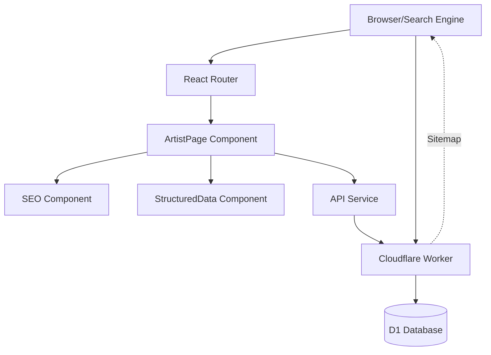

# Design Document: Artist SEO Optimization

## Overview

This design implements comprehensive SEO enhancements for artist discovery on Google search. The system adds dedicated artist pages with rich structured data, dynamic sitemap generation, and optimized meta tags to improve search engine visibility.

The implementation leverages the existing React + TypeScript + Vite frontend with React Router for client-side routing, and extends the Cloudflare Workers backend to serve dynamic sitemaps and artist-specific data. The design follows SEO best practices including semantic HTML, schema.org structured data, Open Graph tags, and proper URL structure.

Key capabilities:
- Individual artist pages with unique URLs (`/artists/{slug}`)
- MusicGroup schema.org structured data for rich search results
- Dynamic XML sitemap generation from D1 database
- Optimized meta tags for search and social sharing
- Breadcrumb navigation with structured data
- Mobile-responsive and performance-optimized pages

## Architecture

### System Components



### Data Flow

1. **Artist Page Request**: User navigates to `/artists/{slug}` → React Router matches route → ArtistPage component loads → Fetches artist data via API → Renders page with SEO components
2. **Sitemap Generation**: Search engine requests `/sitemap.xml` → Cloudflare Worker queries D1 for all artists/news → Generates XML sitemap → Returns with cache headers
3. **Structured Data Injection**: ArtistPage renders → StructuredData component creates JSON-LD script → Injects into document head → Search engine parses schema
4. **Meta Tag Updates**: ArtistPage loads → SEO component receives artist props → Updates document title and meta tags → Search engine indexes metadata

### Technology Stack

- **Frontend**: React 18, TypeScript, Vite, React Router v6
- **Backend**: Cloudflare Workers, D1 SQLite database
- **SEO Libraries**: None required (vanilla implementation)
- **Styling**: CSS modules with existing design system

## Components and Interfaces

### Frontend Components

#### ArtistPage Component

New page component for individual artist display.

```typescript
interface ArtistPageProps {
  // No props - uses URL params
}

interface ArtistPageState {
  artist: Artist | null
  releases: Release[]
  loading: boolean
  error: string | null
}
```

**Responsibilities**:
- Extract artist slug from URL parameters
- Fetch artist data and associated releases from API
- Render artist information with semantic HTML
- Integrate SEO and StructuredData components
- Display breadcrumb navigation
- Handle loading and error states
- Provide 404 handling for invalid slugs

#### Enhanced SEO Component

Extend existing SEO component to support artist-specific metadata.

```typescript
interface SEOProps {
  title?: string
  description?: string
  image?: string
  article?: boolean
  publishedTime?: string
  author?: string
  keywords?: string
  type?: 'website' | 'profile' | 'article'  // NEW
  canonical?: string  // NEW
}
```

**New Features**:
- Support for `profile` type for artist pages
- Explicit canonical URL override
- Twitter Card large image support
- Automatic keyword generation from artist data

#### Enhanced StructuredData Component

Extend existing component with breadcrumb support.

```typescript
interface BreadcrumbItem {
  name: string
  url: string
  position: number
}

interface BreadcrumbStructuredDataProps {
  items: BreadcrumbItem[]
}
```

**New Component**: `BreadcrumbStructuredData`
- Generates BreadcrumbList schema
- Injects JSON-LD into document head
- Follows schema.org BreadcrumbList specification

### Backend API

#### Artist API Enhancement

Extend existing artists API with slug-based lookup.

```typescript
// New endpoint
GET /api/artists/by-slug/:slug

// Response
{
  id: number
  name: string
  genre: string
  description: string
  image?: string
  slug: string  // NEW - generated from name
  order_index?: number
}
```

#### Sitemap API

New endpoint for dynamic sitemap generation.

```typescript
GET /api/sitemap.xml

// Response: XML document
<?xml version="1.0" encoding="UTF-8"?>
<urlset xmlns="http://www.sitemaps.org/schemas/sitemap/0.9">
  <url>
    <loc>https://afterglow-music.pages.dev/</loc>
    <lastmod>2024-01-15</lastmod>
    <changefreq>daily</changefreq>
    <priority>1.0</priority>
  </url>
  <!-- Artist URLs -->
  <url>
    <loc>https://afterglow-music.pages.dev/artists/luna-eclipse</loc>
    <lastmod>2024-01-10</lastmod>
    <changefreq>weekly</changefreq>
    <priority>0.8</priority>
  </url>
  <!-- News URLs -->
  <!-- ... -->
</urlset>
```

### URL Structure

```
/                           - Homepage (priority: 1.0)
/artists                    - Artists listing (priority: 0.9)
/artists/:slug              - Individual artist page (priority: 0.8)
/news                       - News listing (priority: 0.9)
/news/:slug                 - Individual news article (priority: 0.7)
/submit                     - Submission form (priority: 0.8)
/api/sitemap.xml            - Dynamic sitemap
```

### Slug Generation

Artist slugs are generated from artist names using this algorithm:

```typescript
function generateSlug(name: string): string {
  return name
    .toLowerCase()
    .trim()
    .replace(/[^a-z0-9\s-]/g, '')  // Remove special chars
    .replace(/\s+/g, '-')           // Replace spaces with hyphens
    .replace(/-+/g, '-')            // Collapse multiple hyphens
    .replace(/^-|-$/g, '')          // Remove leading/trailing hyphens
}

// Examples:
// "Luna Eclipse" → "luna-eclipse"
// "ARUMA X SB19" → "aruma-x-sb19"
// "Neon Dreams!" → "neon-dreams"
```

## Data Models

### Database Schema Changes

Add `slug` column to existing `artists` table:

```sql
-- Migration: Add slug column
ALTER TABLE artists ADD COLUMN slug TEXT UNIQUE;

-- Generate slugs for existing artists
UPDATE artists 
SET slug = LOWER(
  REPLACE(
    REPLACE(
      REPLACE(name, ' ', '-'),
      '!', ''
    ),
    '?', ''
  )
);

-- Create index for fast slug lookups
CREATE INDEX idx_artists_slug ON artists(slug);
```

### Artist Data Model

```typescript
interface Artist {
  id: number
  name: string
  genre: string
  description: string
  image?: string
  slug: string           // NEW - URL-friendly identifier
  order_index?: number
  created_at?: string
  updated_at?: string
}
```

### Structured Data Schemas

#### MusicGroup Schema

```json
{
  "@context": "https://schema.org",
  "@type": "MusicGroup",
  "name": "Luna Eclipse",
  "genre": "Ambient / Electronic",
  "description": "Visionary ambient producer crafting ethereal soundscapes.",
  "image": "https://afterglow-music.pages.dev/artists/luna-eclipse.jpg",
  "url": "https://afterglow-music.pages.dev/artists/luna-eclipse",
  "recordLabel": {
    "@type": "Organization",
    "name": "Afterglow Music",
    "url": "https://afterglow-music.pages.dev"
  },
  "album": [
    {
      "@type": "MusicAlbum",
      "name": "Midnight Dreams",
      "url": "https://spotify.com/..."
    }
  ]
}
```

#### BreadcrumbList Schema

```json
{
  "@context": "https://schema.org",
  "@type": "BreadcrumbList",
  "itemListElement": [
    {
      "@type": "ListItem",
      "position": 1,
      "name": "Home",
      "item": "https://afterglow-music.pages.dev/"
    },
    {
      "@type": "ListItem",
      "position": 2,
      "name": "Artists",
      "item": "https://afterglow-music.pages.dev/artists"
    },
    {
      "@type": "ListItem",
      "position": 3,
      "name": "Luna Eclipse",
      "item": "https://afterglow-music.pages.dev/artists/luna-eclipse"
    }
  ]
}
```

### Sitemap Data Structure

```typescript
interface SitemapEntry {
  loc: string           // Full URL
  lastmod: string       // ISO 8601 date
  changefreq: 'always' | 'hourly' | 'daily' | 'weekly' | 'monthly' | 'yearly' | 'never'
  priority: number      // 0.0 to 1.0
}

interface SitemapData {
  static: SitemapEntry[]    // Homepage, main sections
  artists: SitemapEntry[]   // Dynamic artist pages
  news: SitemapEntry[]      // Dynamic news articles
}
```


## Correctness Properties

*A property is a characteristic or behavior that should hold true across all valid executions of a system—essentially, a formal statement about what the system should do. Properties serve as the bridge between human-readable specifications and machine-verifiable correctness guarantees.*

### Property Reflection

After analyzing all acceptance criteria, I identified several areas of redundancy:

1. **Meta tag properties (4.1-4.6)** can be consolidated - instead of testing each meta tag type separately, we can test that all required meta tags are present and correctly formatted in a single comprehensive property.

2. **Structured data completeness (2.2, 2.5, 6.3)** - these all test that structured data contains required fields. We can combine into a single property about structured data completeness.

3. **Sitemap entry properties (3.4, 3.5)** - both test specific sitemap attributes. These can be combined into a single property about sitemap entry format.

4. **Image meta tag properties (7.2, 7.3)** - both test that image URLs appear in meta tags. Can be combined into one property.

5. **Semantic HTML properties (5.1, 5.2, 5.3)** - all test that content appears in appropriate HTML tags. Can be combined into one property about semantic structure.

The following properties represent the unique, non-redundant validation requirements:

### Property 1: Slug Generation Consistency

*For any* artist name, generating a slug should produce a lowercase string with spaces replaced by hyphens, special characters removed, and no leading/trailing hyphens.

**Validates: Requirements 1.1, 1.5**

### Property 2: Slug Uniqueness

*For any* set of artists in the database, all generated slugs should be unique (no two artists should have the same slug).

**Validates: Requirements 1.1**

### Property 3: Artist Page Content Completeness

*For any* artist with complete data (name, genre, description), the rendered page should display all fields in the DOM.

**Validates: Requirements 1.2**

### Property 4: Meta Tags Completeness

*For any* artist page, the document head should contain all required meta tags: title, description, keywords, og:title, og:description, og:image, og:type, twitter:card, twitter:title, twitter:description, twitter:image, and canonical link.

**Validates: Requirements 1.3, 1.4, 4.1, 4.2, 4.3, 4.4, 4.5, 4.6**

### Property 5: MusicGroup Structured Data Presence

*For any* artist page, the document head should contain a script tag with type "application/ld+json" containing MusicGroup schema.

**Validates: Requirements 2.1**

### Property 6: Structured Data Completeness

*For any* artist, the generated MusicGroup structured data should include @context, @type, name, genre, description, and recordLabel fields, and if the artist has an image, it should include the image field.

**Validates: Requirements 2.2, 2.5**

### Property 7: Structured Data Schema Validity

*For any* generated structured data, parsing it as JSON should succeed and the @type field should equal "MusicGroup".

**Validates: Requirements 2.3**

### Property 8: Releases in Structured Data

*For any* artist with associated releases, the MusicGroup structured data should include an "album" array containing those releases.

**Validates: Requirements 2.4**

### Property 9: Sitemap Artist Completeness

*For any* set of published artists in the database, the generated sitemap should contain a URL entry for each artist.

**Validates: Requirements 3.1**

### Property 10: Sitemap Entry Format

*For any* artist entry in the sitemap, it should include loc, lastmod, changefreq (set to "weekly"), and priority (set to 0.8) elements.

**Validates: Requirements 3.3, 3.4, 3.5**

### Property 11: Sitemap Data Freshness

*For any* artist, if its data is updated in the database and the sitemap is regenerated, the sitemap should reflect the updated lastmod timestamp.

**Validates: Requirements 3.6**

### Property 12: Meta Description Length Limit

*For any* artist, the generated meta description should not exceed 155 characters.

**Validates: Requirements 4.2**

### Property 13: Semantic HTML Structure

*For any* artist page, the artist name should appear in an H1 tag, the genre should appear in a heading tag (H2-H6), and the description should appear in paragraph tags.

**Validates: Requirements 5.1, 5.2, 5.3**

### Property 14: Releases Display

*For any* artist with releases, the artist page should display each release title and include a link element with href pointing to the streaming platform.

**Validates: Requirements 5.4**

### Property 15: Breadcrumb Structure

*For any* artist page, the breadcrumb navigation should contain exactly three items in order: "Home", "Artists", and the artist name.

**Validates: Requirements 6.1**

### Property 16: Breadcrumb Structured Data

*For any* artist page, the document should contain BreadcrumbList structured data with three ListItem entries, each having position, name, and item fields.

**Validates: Requirements 6.2, 6.3**

### Property 17: Image Alt Text

*For any* artist with an image, the img tag should have an alt attribute containing the artist name.

**Validates: Requirements 7.1**

### Property 18: Image in Meta Tags

*For any* artist page, both og:image and twitter:image meta tags should contain the artist's image URL (or default placeholder if no image).

**Validates: Requirements 7.2, 7.3, 7.4**

### Property 19: Sitemap XML Validity

*For any* generated sitemap, it should be valid XML with an XML declaration, urlset root element, and xmlns attribute set to "http://www.sitemaps.org/schemas/sitemap/0.9".

**Validates: Requirements 8.3, 8.5**

### Property 20: Sitemap Cache Headers

*For any* sitemap response, the Cache-Control header should be set to "public, max-age=3600".

**Validates: Requirements 8.4**

### Property 21: Cache Headers for Artist Pages

*For any* artist page response, appropriate cache headers should be set in the HTTP response.

**Validates: Requirements 10.1**

### Property 22: Lazy Loading Images

*For any* artist page with images, img tags should have the loading="lazy" attribute.

**Validates: Requirements 10.2**

### Property 23: Artist Data Fetching by Slug

*For any* valid artist slug, calling the API endpoint `/api/artists/by-slug/:slug` should return the corresponding artist data.

**Validates: Requirements 11.2**

### Property 24: 404 for Invalid Slugs

*For any* invalid artist slug (not in database), accessing `/artists/:slug` should result in a 404 page being displayed.

**Validates: Requirements 11.3**

### Property 25: URL Encoding for Special Characters

*For any* artist name containing special characters, the generated slug should properly handle them by removing or converting them to valid URL characters.

**Validates: Requirements 11.4**

### Property 26: Sitemap Generation Logging

*For any* sitemap generation request, a log entry should be created recording the event.

**Validates: Requirements 12.3**

